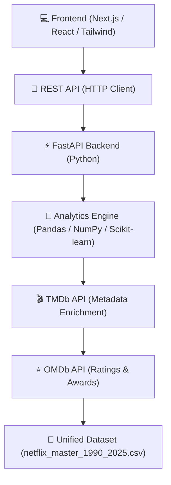
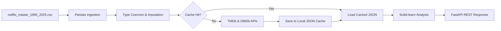

<div align="center">

# 🎬 Netflix Business Intelligence Platform

### Executive-grade analytics for exploring, understanding, and forecasting Netflix content

*An advanced hybrid-architecture Business Intelligence platform built on a unified Netflix dataset (1990–2025)*

<br/>


</div>

---

## 📋 Table of Contents

- [Project Description](#-project-description)
- [Overview](#-overview)
- [Key Features](#-key-features)
- [Tech Stack](#-tech-stack)
- [Architecture](#-architecture)
- [Data Pipeline](#-data-pipeline)
- [Project Structure](#-project-structure)
- [GitHub Structure](#-github-structure)
- [Dashboards](#-dashboards)
- [AI Analytics](#-ai-analytics)
- [TMDb + OMDb Integration](#-tmdb--omdb-integration)
- [Screenshots](#-screenshots)
- [Performance](#-performance)
- [Installation](#-installation)
- [Backend Setup](#-backend-setup)
- [Environment Variables](#-environment-variables)
- [Railway Deployment](#-railway-deployment)
- [Roadmap](#-roadmap)
- [Contributing](#-contributing)
- [Author](#-author)
- [License](#-license)

---

## 📝 Project Description

The **Netflix Business Intelligence Platform** is an enterprise-grade analytics solution designed to ingest, clean, enrich, and visualize Netflix's historical content catalog. Built on a decoupled hybrid architecture, the platform separates computing-heavy analytics logic from user interaction. A high-performance Python FastAPI backend runs queries, serves dataset records, fits predictive regression models, and processes NLP insights, while a modern React/Next.js client displays highly responsive executive-level dashboards.

---

## 🧭 Overview

**The Problem:** Raw Netflix catalog data is unstructured, disconnected from ratings or crew metadata, and difficult for business stakeholders to explore and query without engineering assistance.

**The Solution:** This platform ingests a unified Netflix catalog dataset spanning **1990–2025**, enriches it on-the-fly with third-party **TMDb** and **OMDb** metadata (including posters, cast list, IMDb scores, and runtime details), and exposes it via rich, interactive executive-grade dashboards that blend descriptive, diagnostic, and predictive analytics.

**Why it exists:** To demonstrate a complete, production-ready BI implementation — data ingestion and cleaning, automated metadata enrichment pipelines, interactive reporting dashboards, and natural language analytics queries.

| | |
|---|---|
| 🎯 **Objective** | Turn a static content catalog into a living analytics product |
| 💼 **Business Value** | KPI tracking, content strategy insight, trend forecasting |
| 🧠 **Differentiator** | Combines BI dashboards with an AI-powered natural language insights layer |

---

## ✨ Key Features

- **🏠 Netflix-Style Homepage** — Familiar, polished browsing experience as the platform's front door.
- **📊 Executive Overview** — High-level KPIs — catalog growth, content mix, release trends.
- **📈 Content Insights** — Genre, rating, and language distribution analytics.
- **🌍 People & Geography** — Country-level and talent (actor/director) breakdowns.
- **🔍 Interactive Analytics** — Drill-through filtering across every dimension of the dataset.
- **📉 Predictive Analytics** — Forecasting models on catalog and content trends.
- **🤖 AI Analytics Assistant** — Natural-language querying and auto-generated business insights.
- **🎬 TMDb + ⭐ OMDb Integration** — Posters, backdrops, cast, runtime, and cross-platform ratings.
- **🎭 Actor & Director Analytics** — Performance and filmography breakdowns by talent.
- **🔎 Global Search** — Fast, debounced search across the entire unified dataset.
- **📁 Export Reports** — One-click export to **PDF**, **Excel**, and **PNG**.
- **🎛 Global Filters & Saved Views** — Persist custom filter combinations across sessions.

---

## 🛠 Tech Stack

<details open>
<summary><b>Click to expand/collapse Tech Stack details</b></summary>
<br/>

| Component | Technologies Used |
|---|---|
| **Frontend** | **Next.js 15** (App Router), **React 19**, **TypeScript**, **Tailwind CSS**, **Framer Motion**, **Recharts** |
| **Backend** | **FastAPI** (Python 3.11+), **Uvicorn** (ASGI Server), **Python dotenv** |
| **Analytics Engine** | **Pandas** (Data manipulation), **NumPy** (Vectorized numerical computations), **Scikit-learn** (Predictive modeling & forecasting) |
| **External APIs** | **TMDb API** (Posters, credits, and metadata), **OMDb API** (IMDb ratings, awards, and certification) |
| **Deployment** | **Railway** (Unified single GitHub repository hosting, backend Docker deployment, frontend Node build) |

</details>

---

## 🏗 Architecture

The platform uses a decoupled, hybrid architecture designed for lightning-fast performance, low memory footprint, and scalable analytics execution:

- **Frontend (Next.js & React)**: Renders a smooth, dark-themed, glassmorphic UI. Uses Recharts for dynamic visual representations and Tailwind CSS for responsive layouts.
- **REST API / Rewrite Proxy**: Next.js client utilizes API rewrites to proxy requests securely from the client-side to the API server without exposing backend server URLs.
- **Backend (FastAPI)**: Serves high-speed API endpoints, processes global search indexing, fetches TMDb/OMDb metadata, and interacts with the analytics modules.
- **Analytics & Model Engine**: Pandas and NumPy manage vectorized matrix filtering on the raw datasets. Scikit-learn is utilized to run regression models on release schedules and catalog growth.



---

## 🔀 Data Pipeline

To turn raw rows of static data into enriched business intelligence, the backend executes a structured multi-stage data processing pipeline:



1. **Ingestion & Data Cleaning**: Pandas reads `netflix_master_1990_2025.csv`, normalizes null values, and parses timestamps and list-based categorical properties (genres, countries).
2. **Metadata Cache Verification**: Before hitting external networks, titles are matched against localized JSON caches (`tmdb_cache.json`, `omdb_cache.json`).
3. **API Metadata Enrichment**: If a cache miss occurs, the system makes asynchronous requests to TMDb (for posters/credits) and OMDb (for IMDb ratings/awards) and updates local cache files.
4. **Predictive Analytics**: The engine fits regression models using Scikit-learn to forecast future release frequencies and track genre popularity momentum.
5. **REST API Serialization**: FastAPI serializes dataframes into optimized JSON payloads served to the frontend.

---

## 📁 Project Structure

```
Netflix-Business-Intelligence/
├── frontend/                  # Next.js Application (Client-Side)
│   ├── src/
│   │   ├── app/               # Pages, layout routing, and SSR data fetching
│   │   ├── components/        # Reusable dashboard components and charts
│   │   └── lib/               # Types, helpers, and global context providers
│   ├── public/                # Static assets (images, icons)
│   ├── next.config.ts         # Rewrite routing proxy config
│   └── package.json           # Node dependencies & scripts
├── backend/                   # FastAPI Application (Server-Side)
│   ├── analytics/
│   │   ├── __init__.py
│   │   └── engine.py          # Pandas / NumPy / Scikit-learn analytics engine
│   ├── routers/
│   │   ├── __init__.py
│   │   ├── titles.py          # Enrichment caching endpoints
│   │   ├── search.py          # Search index APIs
│   │   ├── person.py          # TMDb actor and director credit APIs
│   │   ├── assistant.py       # AI Analytics Assistant endpoints
│   │   └── analytics.py       # Analytics dashboard server endpoints
│   ├── config.py              # Configurations & env manager
│   ├── main.py                # FastAPI entry point
│   ├── Dockerfile             # Container configuration for Railway deployment
│   ├── Procfile               # Heroku/Railway process type runner
│   ├── requirements.txt       # Python libraries (FastAPI, Pandas, NumPy, Scikit-learn)
│   └── netflix_master_1990_2025.csv # Core catalog dataset
├── scripts/                   # Data processing and migration utilities
├── images/                    # Screenshot documentation assets
├── docs/                      # Supplemental project documentation files
├── render.yaml                # Optional Render deployment blueprint
└── README.md                  # Main repository README
```

---

## 🐙 GitHub Structure

This repository is structured as a **Single GitHub Repository** (Monorepo), housing both frontend and backend services:
- **`frontend/`**: Isolated Next.js and React client application.
- **`backend/`**: Isolated FastAPI, Python, and analytics pipeline application.
- **Unified CI/CD**: Seamless Git integration allows for atomic commits that update both client features and server routes simultaneously.
- **Independent Build Contexts**: Configured to deploy separate services pointing to their respective subdirectories (`frontend` and `backend`) directly from the same root repository branch.

---

## 📊 Dashboards

| Dashboard | Purpose | Key KPIs |
|---|---|---|
| **Executive Overview** | High-level business snapshot | Total titles, catalog growth rate, content mix |
| **Content Insights** | Understand catalog composition | Genre share, rating distribution, language spread |
| **People & Geography** | Talent and regional analysis | Top countries, top actors/directors |
| **Interactive Analytics** | Ad-hoc exploration | Custom filtered metrics |
| **Predictive Analytics** | Forward-looking trends | Forecasted release volume, genre momentum |
| **AI Insights** | Natural language BI | Auto-generated summaries & recommendations |

---

## 🤖 AI Analytics

The AI Insights layer uses the Python backend (`backend/routers/assistant.py`) and standard NLP strategies to transform raw, aggregated dataset metrics into narrative business intelligence:

- 🗣 **Natural Language Analytics** — Query the database in plain English (e.g., "Which genres grew the most in 2024?") and receive direct answers.
- 💡 **Business Recommendations** — Generate dynamic suggestions on license procurement and release schedules based on content saturation levels.
- 📝 **Executive Summaries** — Deliver stakeholder-ready summaries of trends without exporting to external BI tools.
- 📊 **Visual Insights** — Contextualize charts and forecasting models with detailed plain-language analyses.
- 🎛 **Interactive Filtering** — Update NLP insight scopes dynamically as global filters change on the frontend.

---

## 🎬 TMDb + OMDb Integration

| Data Point | Source |
|---|---|
| Poster & Backdrop images | TMDb |
| Logos | TMDb |
| Cast & Crew | TMDb |
| Runtime & Genres | TMDb |
| Descriptions | TMDb |
| IMDb Ratings | OMDb |
| Cross-platform Ratings | TMDb + OMDb |

---

## 🖼 Screenshots

> Screenshots of the running application displaying calculations from the unified dataset.

<h3 align="center">Homepage</h3>

<p align="center">
  
</p>

<h3 align="center">Executive Overview</h3>

<p align="center">
  
</p>

<h3 align="center">Content Insights</h3>

<p align="center">
  
</p>

<h3 align="center">People & Geography</h3>

<p align="center">
  
</p>

<h3 align="center">Interactive Analytics</h3>

<p align="center">
  
</p>

<h3 align="center">Predictive Analytics</h3>

<p align="center">
  
</p>

---

## ⚡ Performance

- 🖼 **Image Optimization**: Automatic lazy loading and WebP conversion via Next.js `<Image>` components.
- 💾 **Data In-Memory Cache**: Local JSON caches (`tmdb_cache.json` and `omdb_cache.json`) for APIs to avoid rate limits and minimize server response latency.
- ⚙️ **Optimized Calculations**: Vectorized data operations on Pandas dataframes and NumPy arrays, replacing slow row-by-row iteration.
- 📊 **Lightweight ML Models**: Fast fitting and low-latency regression calculations for Scikit-learn predictive charts.
- ⏱ **Debounced Client Requests**: Inputs on global search and NLP query fields are debounced to control request throughput.
- 🧩 **Code Splitting**: Route-level dynamic code splitting inside Next.js to minimize main-bundle size.
- 🗜 **GZip Compression**: Compression middleware configured in FastAPI to minimize JSON response payloads.

---

## 📥 Installation

Follow these steps to clone the repository and prepare the environments for both frontend and backend:

1. **Clone the repository**:
   ```bash
   git clone https://github.com/CHELLURU-AJHITH-KUMAR/netflix-business-intelligence.git
   cd netflix-business-intelligence
   ```
2. **Verify prerequisites**:
   - Python 3.11 or higher
   - Node.js 18.x or higher
   - npm or yarn package manager

---

## ⚙️ Backend Setup

Configure the Python FastAPI environment and launch the REST API server:

1. **Navigate to the backend directory**:
   ```bash
   cd backend
   ```
2. **Initialize Python Virtual Environment**:
   * **Windows (PowerShell)**:
     ```powershell
     python -m venv venv
     .\venv\Scripts\Activate.ps1
     ```
   * **macOS / Linux**:
     ```bash
     python3 -m venv venv
     source venv/bin/activate
     ```
3. **Install Dependencies**:
   ```bash
   pip install -r requirements.txt
   ```
4. **Acquire API Keys**:
   - Register at [TMDb](https://www.themoviedb.org/) and create an API key.
   - Register at [OMDb API](http://www.omdbapi.com/) and create a developer API key.
5. **Setup Environment Variables**:
   Create a file named `.env` in the `backend/` root directory:
   ```env
   TMDB_API_KEY=your_tmdb_api_key
   OMDB_API_KEY=your_omdb_api_key
   PORT=8000
   HOST=0.0.0.0
   ```
6. **Verify Dataset**:
   Ensure `netflix_master_1990_2025.csv` is present in the `backend/` directory.
7. **Run the Backend Server**:
   ```bash
   python main.py
   ```
   The FastAPI backend will start on `http://localhost:8000`. You can inspect the Swagger API documentation at `http://localhost:8000/docs`.

---

## 💻 Frontend Setup

Configure and run the Next.js development server:

1. **Navigate to the frontend directory**:
   From the project root:
   ```bash
   cd frontend
   ```
2. **Install Node Packages**:
   ```bash
   npm install
   ```
3. **Setup Environment Variables**:
   Create a file named `.env.local` inside the `frontend/` directory:
   ```env
   BACKEND_API_URL=http://localhost:8000
   NEXT_PUBLIC_API_URL=http://localhost:8000
   ```
4. **Run the Development Server**:
   ```bash
   npm run dev
   ```
   Open `http://localhost:3000` in your browser to view the application.
5. **Build for Production**:
   ```bash
   npm run build
   ```

---

## 🔐 Environment Variables

### Backend Configuration (`backend/.env`)

| Variable | Description | Required | Default |
| --- | --- | --- | --- |
| `TMDB_API_KEY` | The Movie Database API key for posters/crew details. | **Yes** | — |
| `OMDB_API_KEY` | Open Movie Database API key for IMDb ratings/awards. | **Yes** | — |
| `PORT` | Local FastAPI port binding. | No | `8000` |
| `HOST` | Local FastAPI host binding. | No | `0.0.0.0` |

### Frontend Configuration (`frontend/.env.local`)

| Variable | Description | Required | Default |
| --- | --- | --- | --- |
| `BACKEND_API_URL` | Internal URL for Next.js Server-Side Rendering (SSR) API calls. | **Yes** | `http://localhost:8000` |
| `NEXT_PUBLIC_API_URL` | External URL proxying client-side fetch calls back to FastAPI. | **Yes** | `http://localhost:8000` |

> ⚠️ **Security Warning:** Never commit `.env` or `.env.local` files to Git. They are ignored by default via `.gitignore`.

---

## ☁️ Railway Deployment

The platform is designed for hosting on **Railway**, deploying directly from your Single GitHub Repository.

### Step 1: Create a Railway Project
1. Log in to [Railway](https://railway.app/).
2. Click **New Project** and select **Deploy from GitHub repo**.
3. Choose your repository.

### Step 2: Deploy the FastAPI Backend
1. In the repository configuration options, change the **Service Name** to `backend`.
2. Go to **Settings** > **General** > **Root Directory** and set it to `/backend`.
3. In the **Variables** tab, add your production environment variables:
   - `TMDB_API_KEY`
   - `OMDB_API_KEY`
   - `PORT` (Railway will automatically inject this, but you can explicitly define it as `8000` or leave it empty so Railway assigns it dynamically).
4. Railway will build and deploy using the `Dockerfile` inside `backend/`.
5. Under **Settings** > **Domains**, generate a public domain (e.g., `https://netflix-analytics-backend-production.up.railway.app`).

### Step 3: Deploy the Next.js Frontend
1. Click **New** > **GitHub Repo** inside your Railway project workspace and select the same repository.
2. Change the **Service Name** to `frontend`.
3. Go to **Settings** > **General** > **Root Directory** and set it to `/frontend`.
4. In the **Variables** tab, add the environment variables pointing to your backend URL:
   - `BACKEND_API_URL` = `https://netflix-analytics-backend-production.up.railway.app` (your generated backend domain)
   - `NEXT_PUBLIC_API_URL` = `https://netflix-analytics-backend-production.up.railway.app`
5. Railway will compile the Next.js app using `npm run build` and run it via `npm start`.
6. Under **Settings** > **Domains**, generate a public domain for the frontend (e.g., `https://netflix-business-intelligence.up.railway.app`).

### 🔗 Production URLs
- **Frontend Live App**: `https://netflix-business-intelligence.up.railway.app/`
- **Backend Swagger API**: `https://netflix-analytics-backend-production.up.railway.app/docs`

---

## 🗺 Roadmap

- [x] ⚡ **FastAPI Migration**: Port analytical calculations to high-performance Python backend.
- [x] ☁️ **Railway Deployment**: Setup unified monorepo hosting pipeline.
- [ ] 📈 **Scikit-learn Fine-tuning**: Advance predictive modeling with seasonal time-series analytics.
- [ ] 🔌 **Power BI Connector**: Enable seamless integration with enterprise reporting interfaces.
- [ ] 🗣 **LLM Integration**: Expand the AI Assistant to support advanced prompt reasoning.
- [ ] 📡 **Live Streaming Trends**: Hook into streaming API feeds for real-time tracking.

---

## 🤝 Contributing

Contributions are welcome!

1. Fork the repository
2. Create a feature branch (`git checkout -b feature/amazing-feature`)
3. Commit your changes (`git commit -m 'Add amazing feature'`)
4. Push to the branch (`git push origin feature/amazing-feature`)
5. Open a Pull Request

---

## 👤 Author

<div align="center">

**CHELLURU AJHITH KUMAR**

Data Analyst · Business Intelligence · Power BI · SQL · Python · Next.js

[](https://github.com/CHELLURU-AJHITH-KUMAR)
[](https://linkedin.com/in/your-linkedin-handle)

</div>

---

## 📄 License

Distributed under the **MIT License**. See `LICENSE` for more information.

---

<div align="center">

**Built with ❤️ by Ajhith Kumar Chelluru**

⭐ If you found this project useful, consider giving it a star!

</div>

