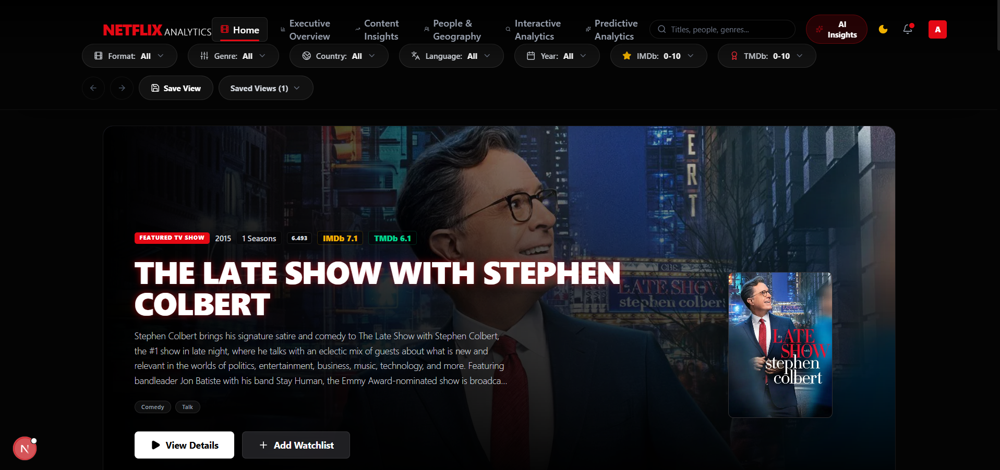
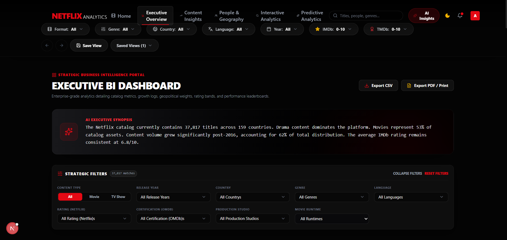
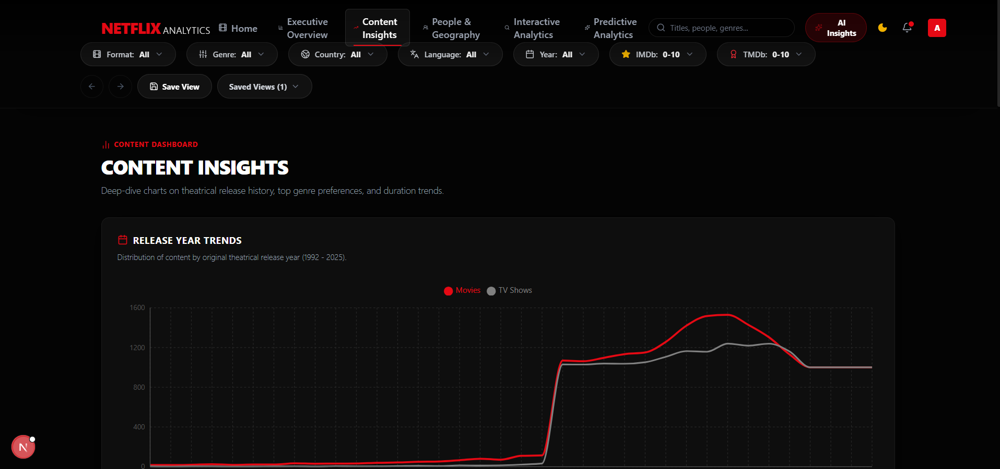
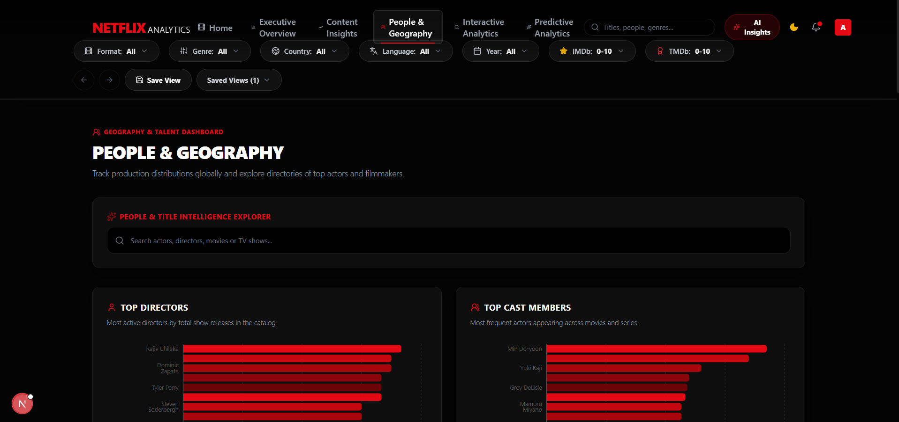
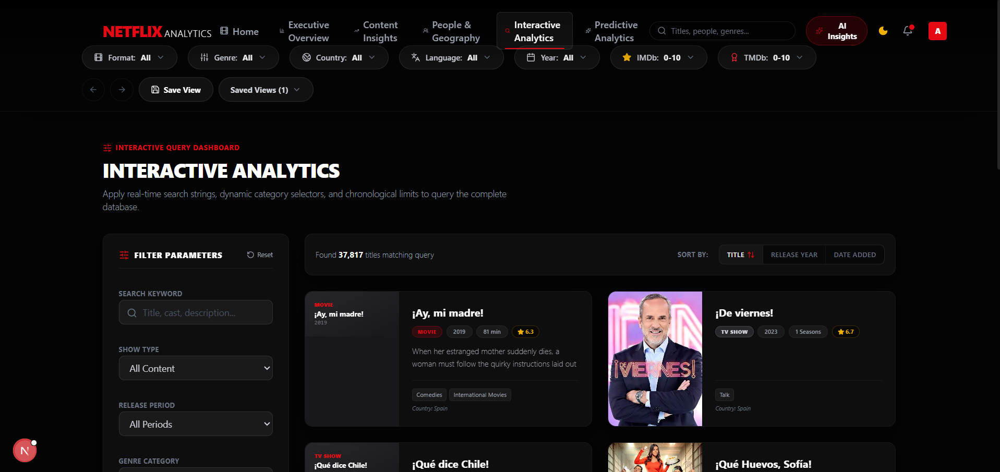
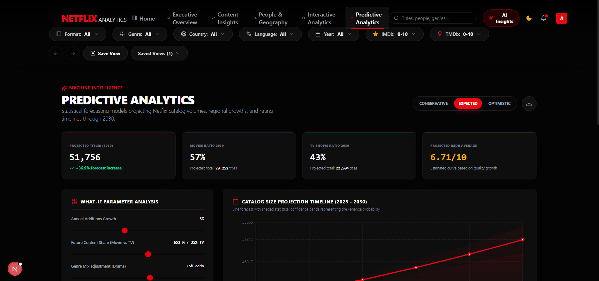

<div align="center">

# 🎬 Netflix Business Intelligence Platform

### Executive-grade analytics for exploring, understanding, and forecasting Netflix content

*Not a Netflix clone — a full-stack Business Intelligence platform built on a unified Netflix dataset (1990–2025)*

<br/>


---

## 📋 Table of Contents

<details>
<summary><b>Click to expand</b></summary>

- [Overview](#-overview)
- [Key Features](#-key-features)
- [Tech Stack](#-tech-stack)
- [Architecture](#-architecture)
- [Data Pipeline](#-data-pipeline)
- [Project Structure](#-project-structure)
- [Dashboards](#-dashboards)
- [AI Analytics](#-ai-analytics)
- [TMDb + OMDb Integration](#-tmdb--omdb-integration)
- [Screenshots](#-screenshots)
- [Performance](#-performance)
- [Installation](#-installation)
- [Environment Variables](#-environment-variables)
- [Deployment](#-deployment)
- [Roadmap](#-roadmap)
- [Contributing](#-contributing)
- [Author](#-author)
- [License](#-license)

</details>

---

## 🧭 Overview

**The Problem:** Raw Netflix catalog data is unstructured, disconnected from ratings/cast metadata, and impossible for business stakeholders to explore without engineering support.

**The Solution:** This platform ingests a unified Netflix dataset spanning **1990–2025**, enriches it with **TMDb** and **OMDb** metadata (posters, ratings, cast, genres), and surfaces it through interactive, executive-ready dashboards — combining descriptive, diagnostic, and predictive analytics in one place.

**Why it exists:** To demonstrate an end-to-end BI workflow — data engineering, enrichment pipelines, interactive visualization, and AI-assisted insight generation — the same skillset used to turn raw business data into decisions.

| | |
|---|---|
| 🎯 **Objective** | Turn a static content catalog into a living analytics product |
| 💼 **Business Value** | KPI tracking, content strategy insight, trend forecasting |
| 🧠 **Differentiator** | Combines BI dashboards with an AI-powered natural language insights layer |

---

## ✨ Key Features

<table>
<tr>
<td width="50%">

### 🏠 Netflix-Style Homepage
Familiar, polished browsing experience as the platform's front door.

</td>
<td width="50%">

### 📊 Executive Overview
High-level KPIs — catalog growth, content mix, release trends.

</td>
</tr>
<tr>
<td width="50%">

### 📈 Content Insights
Genre, rating, and language distribution analytics.

</td>
<td width="50%">

### 🌍 People & Geography
Country-level and talent (actor/director) breakdowns.

</td>
</tr>
<tr>
<td width="50%">

### 🔍 Interactive Analytics
Drill-through filtering across every dimension of the dataset.

</td>
<td width="50%">

### 📉 Predictive Analytics
Forecasting models on catalog and content trends.

</td>
</tr>
<tr>
<td width="50%">

### 🤖 AI Analytics Assistant
Natural-language querying and auto-generated business insights.

</td>
<td width="50%">

### 🎬 TMDb + ⭐ OMDb Integration
Posters, backdrops, cast, runtime, and cross-platform ratings.

</td>
</tr>
<tr>
<td width="50%">

### 🎭 Actor & Director Analytics
Performance and filmography breakdowns by talent.

</td>
<td width="50%">

### 🔎 Global Search
Fast, debounced search across the entire unified dataset.

</td>
</tr>
<tr>
<td width="50%">

### 📁 Export Reports
One-click export to **PDF**, **Excel**, and **PNG**.

</td>
<td width="50%">

### 🎛 Global Filters & Saved Views
Persist custom filter combinations across sessions.

</td>
</tr>
</table>

---

## 🛠 Tech Stack

| Category | Technologies |
|---|---|
| **Frontend** | Next.js, React, TypeScript, Tailwind CSS |
| **Visualization** | Recharts, custom interactive charts |
| **Analytics Engine** | Predictive analytics modules, AI insights layer |
| **External APIs** | TMDb API, OMDb API |
| **Data Layer** | Unified Netflix dataset (`netflix_master_1990_2025.csv`), enrichment caches |
| **Tooling** | ESLint, PostCSS |
| **Deployment** | Vercel |

---

## 🏗 Architecture

```
Netflix Dataset (1990–2025)
          │
          ▼
     Preprocessing
          │
          ▼
   TMDb Enrichment
          │
          ▼
   OMDb Enrichment
          │
          ▼
    Unified Dataset
          │
          ▼
    Analytics Engine
   ┌──────┼───────────────┐
   │      │               │
Executive Content   Predictive
Overview Insights   Analytics
   │      │               │
   └──────┴───────┬───────┘
                   ▼
             AI Insights Layer
```

## 🔄 Data Pipeline

1. **Ingest** — raw Netflix catalog (`netflix_master_1990_2025.csv`)
2. **Preprocess** — clean, normalize, and de-duplicate records
3. **Enrich (TMDb)** — posters, backdrops, cast, genres, runtime
4. **Enrich (OMDb)** — IMDb ratings, additional metadata (`omdb_enrichment_report.json`)
5. **Unify** — merge into a single analytics-ready dataset, with results cached (`tmdb_cache.json`, `omdb_cache.json`) for performance
6. **Analyze** — feed into dashboards, forecasting models, and the AI insights layer

---

## 📁 Project Structure

```
netflix-business-intelligence/
├── src/
│   ├── app/                  # Next.js app router pages
│   │   └── api/               # API routes (TMDb/OMDb proxying, analytics endpoints)
│   ├── components/            # Reusable UI & dashboard components
│   └── lib/                   # Utilities, data access, analytics helpers
├── scripts/                   # Data enrichment & preprocessing scripts
├── public/                    # Static assets (images, banner, icons)
├── netflix_master_1990_2025.csv   # Core unified dataset
├── tmdb_cache.json            # Cached TMDb API responses
├── omdb_cache.json            # Cached OMDb API responses
├── omdb_enrichment_report.json # Enrichment run summary
├── next.config.ts
├── package.json
└── README.md
```

---

## 📊 Dashboards

| Dashboard | Purpose | Key KPIs |
|---|---|---|
| **Executive Overview** | High-level business snapshot | Total titles, catalog growth rate, content mix |
| **Content Insights** | Understand catalog composition | Genre share, rating distribution, language spread |
| **People & Geography** | Talent and regional analysis | Top countries, top actors/directors |
| **Interactive Analytics** | Ad-hoc exploration | Custom filtered metrics |
| **Predictive Analytics** | Forward-looking trends | Forecasted release volume, genre momentum |
| **AI Insights** | Natural language BI | Auto-generated summaries & recommendations |

---

## 🤖 AI Analytics

The AI Insights layer turns raw metrics into narrative business intelligence:

- 🗣 **Natural Language Analytics** — ask questions about the catalog in plain English
- 💡 **Business Recommendations** — auto-generated, data-backed suggestions
- 📝 **Executive Summaries** — concise, stakeholder-ready write-ups of key trends
- 📊 **Visual Insights** — charts contextualized with plain-language explanations
- 🎛 **Interactive Filtering** — insights update live as filters change

---

## 🎬 TMDb + OMDb Integration

| Data Point | Source |
|---|---|
| Poster & Backdrop images | TMDb |
| Logos | TMDb |
| Cast & Crew | TMDb |
| Runtime & Genres | TMDb |
| Descriptions | TMDb |
| IMDb Ratings | OMDb |
| Cross-platform Ratings | TMDb + OMDb |

---

## 🖼 Screenshots

> Screenshots coming soon — replace the placeholders below with real captures.

**Homepage**
<h3 align="center">Homepage</h3>

<p align="center">
  
</p>

<h3 align="center">Executive Overview</h3>

<p align="center">
  
</p>

<h3 align="center">Content Insights</h3>

<p align="center">
  
</p>

<h3 align="center">People & Geography</h3>

<p align="center">
  
</p>

<h3 align="center">Interactive Analytics</h3>

<p align="center">
  
</p>

<h3 align="center">Predictive Analytics</h3>

<p align="center">
  
</p>

---

## ⚡ Performance

- 🖼 Image lazy loading with Next.js `<Image>` optimization
- 💾 API response caching (TMDb / OMDb) to minimize redundant calls
- ⏱ Debounced global search
- 🧩 Code splitting per route
- 🖥 Server-side data loading for faster first paint

---

## 🚀 Installation

```bash
# Clone the repository
git clone https://github.com/CHELLURU-AJHITH-KUMAR/netflix-business-intelligence.git

# Navigate into the project
cd netflix-business-intelligence

# Install dependencies
npm install

# Run the development server
npm run dev
```

Open [http://localhost:3000](http://localhost:3000) to view the app.

---

## 🔐 Environment Variables

Create a `.env.local` file in the project root:

```env
TMDB_API_KEY=your_tmdb_api_key_here
OMDB_API_KEY=your_omdb_api_key_here
```

> ⚠️ Never commit real API keys. Use `.env.local` and ensure it's listed in `.gitignore`.

---

## ☁️ Deployment

This project is optimized for deployment on **Vercel**:

1. Push your repository to GitHub
2. Import the project into [Vercel](https://vercel.com/new)
3. Add `TMDB_API_KEY` and `OMDB_API_KEY` under **Project Settings → Environment Variables**
4. Deploy 🚀

---

## 🗺 Roadmap

- [ ] 🎯 Recommendation Engine
- [ ] 🔌 Power BI Connector
- [ ] 📡 Streaming Trends Analytics
- [ ] 🔄 Live Netflix Catalog Updates
- [ ] 🧠 LLM-Powered Business Insights

---

## 🤝 Contributing

Contributions are welcome!

1. Fork the repository
2. Create a feature branch (`git checkout -b feature/amazing-feature`)
3. Commit your changes (`git commit -m 'Add amazing feature'`)
4. Push to the branch (`git push origin feature/amazing-feature`)
5. Open a Pull Request

---

## 👤 Author

<div align="center">

**CHELLURU AJHITH KUMAR**

Data Analyst · Business Intelligence · Power BI · SQL · Python · Next.js

[](https://github.com/CHELLURU-AJHITH-KUMAR)
[](https://linkedin.com/in/your-linkedin-handle)

</div>

---

## 📄 License

Distributed under the **MIT License**. See `LICENSE` for more information.

---

<div align="center">

**Built with ❤️ by Ajhith Kumar Chelluru**

⭐ If you found this project useful, consider giving it a star!

</div>
