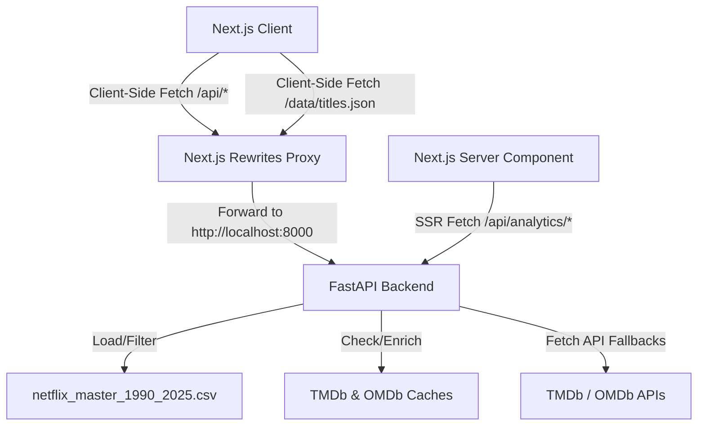

<div align="center">

# 🎬 Netflix Business Intelligence Platform

### Executive-grade analytics for exploring, understanding, and forecasting Netflix content

*An advanced hybrid-architecture Business Intelligence platform built on a unified Netflix dataset (1990–2025)*

<br/>


</div>

---

## 📋 Table of Contents

- [Overview](#-overview)
- [Key Features](#-key-features)
- [Architecture](#-architecture)
- [Project Structure](#-project-structure)
- [Dashboards](#-dashboards)
- [AI Analytics](#-ai-analytics)
- [TMDb + OMDb Integration](#-tmdb--omdb-integration)
- [Screenshots](#-screenshots)
- [Performance](#-performance)
- [Local Development](#-local-development)
- [Environment Variables](#-environment-variables)
- [Render Deployment](#-render-deployment)
- [Roadmap](#-roadmap)
- [Contributing](#-contributing)
- [Author](#-author)
- [License](#-license)

---

## 🧭 Overview

**The Problem:** Raw Netflix catalog data is unstructured, disconnected from ratings/cast metadata, and impossible for business stakeholders to explore without engineering support.

**The Solution:** This platform ingests a unified Netflix dataset spanning **1990–2025**, enriches it with **TMDb** and **OMDb** metadata (posters, ratings, cast, genres), and surfaces it through interactive, executive-ready dashboards — combining descriptive, diagnostic, and predictive analytics in one place.

**Why it exists:** To demonstrate an end-to-end BI workflow — data engineering, enrichment pipelines, interactive visualization, and AI-assisted insight generation — the same skillset used to turn raw business data into decisions.

| | |
|---|---|
| 🎯 **Objective** | Turn a static content catalog into a living analytics product |
| 💼 **Business Value** | KPI tracking, content strategy insight, trend forecasting |
| 🧠 **Differentiator** | Combines BI dashboards with an AI-powered natural language insights layer |

---

## ✨ Key Features

- **🏠 Netflix-Style Homepage** — Familiar, polished browsing experience as the platform's front door.
- **📊 Executive Overview** — High-level KPIs — catalog growth, content mix, release trends.
- **📈 Content Insights** — Genre, rating, and language distribution analytics.
- **🌍 People & Geography** — Country-level and talent (actor/director) breakdowns.
- **🔍 Interactive Analytics** — Drill-through filtering across every dimension of the dataset.
- **📉 Predictive Analytics** — Forecasting models on catalog and content trends.
- **🤖 AI Analytics Assistant** — Natural-language querying and auto-generated business insights.
- **🎬 TMDb + ⭐ OMDb Integration** — Posters, backdrops, cast, runtime, and cross-platform ratings.
- **🎭 Actor & Director Analytics** — Performance and filmography breakdowns by talent.
- **🔎 Global Search** — Fast, debounced search across the entire unified dataset.
- **📁 Export Reports** — One-click export to **PDF**, **Excel**, and **PNG**.
- **🎛 Global Filters & Saved Views** — Persist custom filter combinations across sessions.

---

## 🏗 Architecture

This project is built using a **Hybrid Architecture** designed for high-performance and low-footprint deployment:
- **Frontend**: Next.js + TypeScript (React 19) providing a smooth, dark-themed, glassmorphic UI with animations (Framer Motion) and charting (Recharts).
- **Backend**: FastAPI (Python 3.13) + Pandas + Numpy, executing fast calculations, data parsing, global search indexing, and AI Analytics Assistant tasks.
- **Data Layer**: All large datasets (`netflix_master_1990_2025.csv`) and TMDb/OMDb JSON caching files are maintained strictly backend-side, ensuring minimized client bundles.



---

## 📁 Project Structure

```
Netflix-Business-Intelligence/
├── frontend/                  # Next.js Application
│   ├── src/
│   │   ├── app/               # Next.js Pages & SSR Components
│   │   ├── components/        # UI Dashboards, Modals, Cards, Drawer
│   │   └── lib/
│   │       ├── data.ts        # TypeScript Type Definitions
│   │       └── GlobalFilterContext.tsx
│   ├── public/                # Static assets
│   ├── next.config.ts         # Rewrite Proxies to Backend
│   └── package.json
├── backend/                   # FastAPI Python Application
│   ├── analytics/
│   │   ├── __init__.py
│   │   └── engine.py          # Data Parsing & Analytics Engine
│   ├── routers/
│   │   ├── __init__.py
│   │   ├── titles.py          # Metadata & Caching APIs
│   │   ├── search.py          # Global Search API
│   │   ├── person.py          # TMDb actor/director API
│   │   ├── assistant.py       # AI Analytics Assistant
│   │   └── analytics.py       # SSR Analytics Pages & data serving
│   ├── config.py              # Configuration manager
│   ├── main.py                # FastAPI Application Entry
│   ├── requirements.txt       # Python Dependencies
│   └── netflix_master_1990_2025.csv # Catalog Dataset
├── scripts/                   # Helper preprocessing scripts
├── images/                    # UI illustrations
├── render.yaml                # Render Blueprint Deployment File
└── README.md
```

---

## 📊 Dashboards

| Dashboard | Purpose | Key KPIs |
|---|---|---|
| **Executive Overview** | High-level business snapshot | Total titles, catalog growth rate, content mix |
| **Content Insights** | Understand catalog composition | Genre share, rating distribution, language spread |
| **People & Geography** | Talent and regional analysis | Top countries, top actors/directors |
| **Interactive Analytics** | Ad-hoc exploration | Custom filtered metrics |
| **Predictive Analytics** | Forward-looking trends | Forecasted release volume, genre momentum |
| **AI Insights** | Natural language BI | Auto-generated summaries & recommendations |

---

## 🤖 AI Analytics

The AI Insights layer turns raw metrics into narrative business intelligence:

- 🗣 **Natural Language Analytics** — ask questions about the catalog in plain English
- 💡 **Business Recommendations** — auto-generated, data-backed suggestions
- 📝 **Executive Summaries** — concise, stakeholder-ready write-ups of key trends
- 📊 **Visual Insights** — charts contextualized with plain-language explanations
- 🎛 **Interactive Filtering** — insights update live as filters change

---

## 🎬 TMDb + OMDb Integration

| Data Point | Source |
|---|---|
| Poster & Backdrop images | TMDb |
| Logos | TMDb |
| Cast & Crew | TMDb |
| Runtime & Genres | TMDb |
| Descriptions | TMDb |
| IMDb Ratings | OMDb |
| Cross-platform Ratings | TMDb + OMDb |

---

## 🖼 Screenshots

> Screenshots coming soon — replace the placeholders below with real captures.

**Homepage**
<h3 align="center">Homepage</h3>

<p align="center">
  
</p>

<h3 align="center">Executive Overview</h3>

<p align="center">
  
</p>

<h3 align="center">Content Insights</h3>

<p align="center">
  
</p>

<h3 align="center">People & Geography</h3>

<p align="center">
  
</p>

<h3 align="center">Interactive Analytics</h3>

<p align="center">
  
</p>

<h3 align="center">Predictive Analytics</h3>

<p align="center">
  
</p>

---

## ⚡ Performance

- 🖼 Image lazy loading with Next.js `<Image>` optimization
- 💾 API response caching (TMDb / OMDb) to minimize redundant calls
- ⏱ Debounced global search
- 🧩 Code splitting per route
- 🖥 Server-side data loading for faster first paint
- 🗜 GZip compression middleware implemented backend-side for optimal data transfer

---

## 🚀 Local Development

### 1. Run Backend (FastAPI)
1. Navigate to the `backend/` folder:
   ```bash
   cd backend
   ```
2. Create and activate a virtual environment, then install requirements:
   ```bash
   pip install -r requirements.txt
   ```
3. Start the FastAPI server (listening on port 8000):
   ```bash
   python main.py
   ```

### 2. Run Frontend (Next.js)
1. Navigate to the `frontend/` folder:
   ```bash
   cd ../frontend
   ```
2. Install npm packages:
   ```bash
   npm install
   ```
3. Run the development server (listening on port 3000):
   ```bash
   npm run dev
   ```
4. Build for production:
   ```bash
   npm run build
   ```

---

## 🔐 Environment Variables

The backend relies on the following environment variables. Set them in a `.env` file inside `backend/` or directly in your hosting dashboard:

| Variable | Description | Required |
| --- | --- | --- |
| `TMDB_API_KEY` | The Movie Database (TMDb) API key for posters/credits/crew fallbacks | Yes |
| `OMDB_API_KEY` | Open Movie Database (OMDb) API key for certificate/award/box office fallbacks | Yes |
| `PORT` | Local FastAPI port (default: `8000`) | No |

The frontend relies on the following environment variables inside `frontend/.env.local`:

| Variable | Description | Default |
| --- | --- | --- |
| `BACKEND_API_URL` | Internal FastAPI backend endpoint for SSR fetches | `http://localhost:8000` |
| `NEXT_PUBLIC_API_URL` | External FastAPI backend URL for client rewrites | `http://localhost:8000` |

> ⚠️ Never commit real API keys. Use environment variables and ensure files like `.env.local` are listed in `.gitignore`.

---

## ☁️ Render Deployment

This project contains a `render.yaml` Blueprint specification, enabling one-click deployment for both Next.js and FastAPI from this repository.

### Manual Steps:
1. Connect this repository to your **Render** dashboard.
2. Select **Blueprints** and create a new environment.
3. Configure the `TMDB_API_KEY` and `OMDB_API_KEY` when prompted in the Render blueprint dashboard.
4. Render will automatically detect `render.yaml` and provision both services.

---

## 🗺 Roadmap

- [ ] 🎯 Recommendation Engine
- [ ] 🔌 Power BI Connector
- [ ] 📡 Streaming Trends Analytics
- [ ] 🔄 Live Netflix Catalog Updates
- [ ] 🧠 LLM-Powered Business Insights

---

## 🤝 Contributing

Contributions are welcome!

1. Fork the repository
2. Create a feature branch (`git checkout -b feature/amazing-feature`)
3. Commit your changes (`git commit -m 'Add amazing feature'`)
4. Push to the branch (`git push origin feature/amazing-feature`)
5. Open a Pull Request

---

## 👤 Author

<div align="center">

**CHELLURU AJHITH KUMAR**

Data Analyst · Business Intelligence · Power BI · SQL · Python · Next.js

[](https://github.com/CHELLURU-AJHITH-KUMAR)
[](https://linkedin.com/in/your-linkedin-handle)

</div>

---

## 📄 License

Distributed under the **MIT License**. See `LICENSE` for more information.

---

<div align="center">

**Built with ❤️ by Ajhith Kumar Chelluru**

⭐ If you found this project useful, consider giving it a star!

</div>
