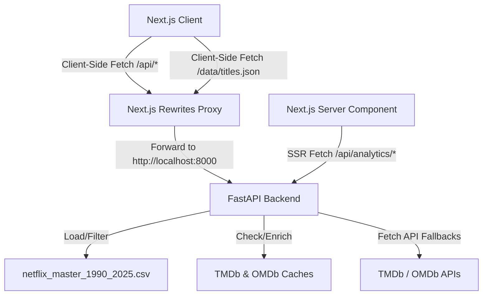

# Netflix Business Intelligence Dashboard

A professional hybrid-architecture web application for comprehensive catalog analysis, business intelligence, and predictive forecasting of Netflix datasets.

## Architecture

This project is built using a **Hybrid Architecture** designed for high-performance and low-footprint deployment:
- **Frontend**: Next.js + TypeScript (React 19) providing a smooth, dark-themed, glassmorphic UI with animations (Framer Motion) and charting (Recharts).
- **Backend**: FastAPI (Python 3.13) + Pandas + Numpy, executing fast calculations, data parsing, global search indexing, and AI Analytics Assistant tasks.
- **Data Layer**: All large datasets (`netflix_master_1990_2025.csv`) and TMDb/OMDb JSON caching files are maintained strictly backend-side, ensuring minimized client bundles.



---

## Folder Structure

```
Netflix-Business-Intelligence/
├── frontend/                  # Next.js Application
│   ├── src/
│   │   ├── app/               # Next.js Pages & SSR Components
│   │   ├── components/        # UI Dashboards, Modals, Cards, Drawer
│   │   └── lib/
│   │       ├── data.ts        # TypeScript Type Definitions
│   │       └── GlobalFilterContext.tsx
│   ├── public/                # Static assets
│   ├── next.config.ts         # Rewrite Proxies to Backend
│   └── package.json
├── backend/                   # FastAPI Python Application
│   ├── analytics/
│   │   ├── __init__.py
│   │   └── engine.py          # Data Parsing & Analytics Engine
│   ├── routers/
│   │   ├── __init__.py
│   │   ├── titles.py          # Metadata & Caching APIs
│   │   ├── search.py          # Global Search API
│   │   ├── person.py          # TMDb actor/director API
│   │   ├── assistant.py       # AI Analytics Assistant
│   │   └── analytics.py       # SSR Analytics Pages & data serving
│   ├── config.py              # Configuration manager
│   ├── main.py                # FastAPI Application Entry
│   ├── requirements.txt       # Python Dependencies
│   └── netflix_master_1990_2025.csv # Catalog Dataset
├── scripts/                   # Helper preprocessing scripts
├── images/                    # UI illustrations
├── render.yaml                # Render Blueprint Deployment File
└── README.md
```

---

## Environment Variables

The backend relies on the following environment variables. Set them in a `.env` file inside `backend/` or directly in your hosting dashboard:

| Variable | Description | Required |
| --- | --- | --- |
| `TMDB_API_KEY` | The Movie Database (TMDb) API key for posters/credits/crew fallbacks | Yes |
| `OMDB_API_KEY` | Open Movie Database (OMDb) API key for certificate/award/box office fallbacks | Yes |
| `PORT` | Local FastAPI port (default: `8000`) | No |

The frontend relies on the following environment variables inside `frontend/.env.local`:

| Variable | Description | Default |
| --- | --- | --- |
| `BACKEND_API_URL` | Internal FastAPI backend endpoint for SSR fetches | `http://localhost:8000` |
| `NEXT_PUBLIC_API_URL` | External FastAPI backend URL for client rewrites | `http://localhost:8000` |

---

## Local Development

### 1. Run Backend (FastAPI)
1. Navigate to the `backend/` folder:
   ```bash
   cd backend
   ```
2. Create and activate a virtual environment, then install requirements:
   ```bash
   pip install -r requirements.txt
   ```
3. Start the FastAPI server (listening on port 8000):
   ```bash
   python main.py
   ```

### 2. Run Frontend (Next.js)
1. Navigate to the `frontend/` folder:
   ```bash
   cd ../frontend
   ```
2. Install npm packages:
   ```bash
   npm install
   ```
3. Run the development server (listening on port 3000):
   ```bash
   npm run dev
   ```
4. Build for production:
   ```bash
   npm run build
   ```

---

## Render Deployment

This project contains a `render.yaml` Blueprint specification, enabling one-click deployment for both Next.js and FastAPI from this repository.

### Manual Steps:
1. Connect this repository to your **Render** dashboard.
2. Select **Blueprints** and create a new environment.
3. Configure the `TMDB_API_KEY` and `OMDB_API_KEY` when prompted in the Render blueprint dashboard.
4. Render will automatically detect `render.yaml` and provision both services.
